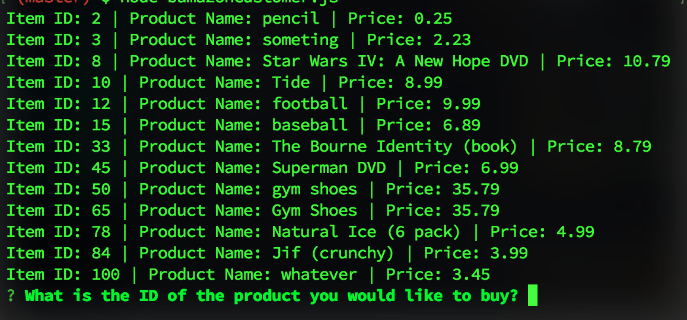
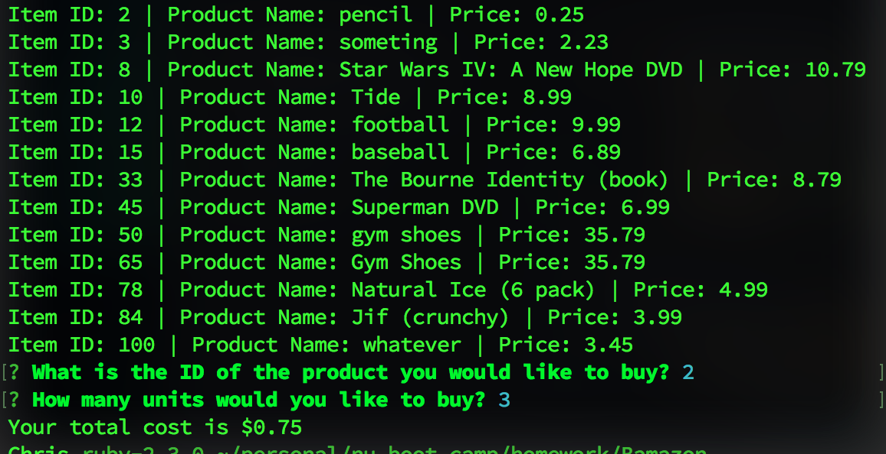
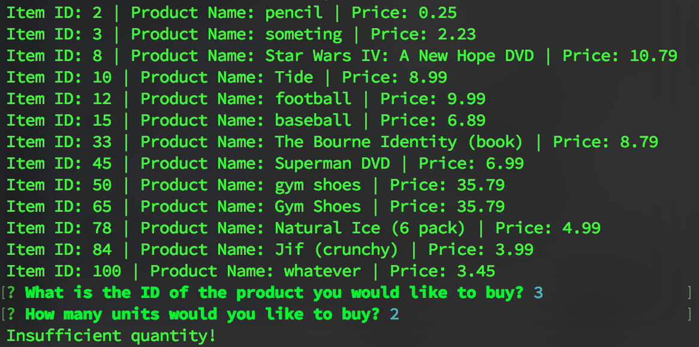

# Bamazon

NU Coding BootCamp HW 10

In this repo are two applications, `bamazonCustomer.js` and `bamazonManager.js`.
For either of these to work you will first need to have `mySQL` installed. Then
run the script in `bamazon.sql` to set up the database for these apps.

**NOTE**: You will need to add a file called `keys.js` with the username and
password for your mySQL database. The file should look like this:

```javascript
exports.databaseKeys = {
    username: < your_username >,
    password: < your_password >
};
```

## Bamazon Customer

To run this simply run:

```
node bamazonCustomer.js
```

You will first see a list of the available items and a prompt asking you which
item you would like to purchase.



You will then choose the quantity of the item you would like to purchase. If
there are sufficient quantities available, you will see a success message and
the total cost to you.



If there are not sufficient quantities available, you will see a failure
message.


